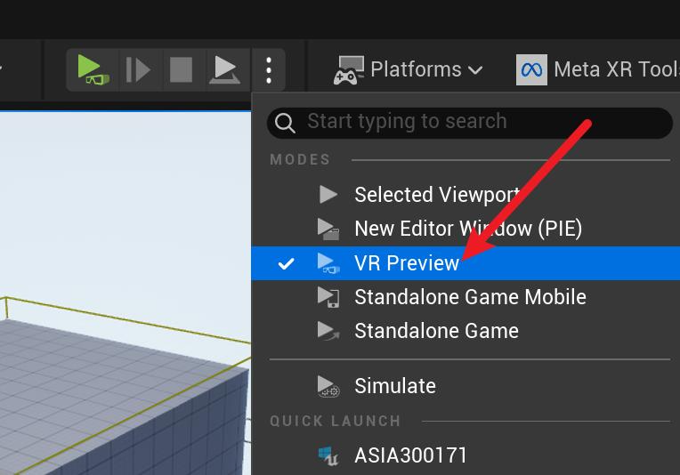

# UE5中使用Meta Quest Pro进行VR模型查看操作指南

---

## 1. 环境准备

- 安装 Unreal Engine 5.5.4 版本
- 准备 Meta Quest Pro 或其他兼容的 VR 设备
- 下载并安装 Meta Quest Link 桌面软件（注意：中国局域网内可能无法正常使用）

## 2. 连接 Meta Quest Pro 到电脑

1. 打开 Meta Quest Link 桌面软件，升级至最新驱动。
2. 在 Meta Quest Link 桌面软件中选择添加设备
    - **USB 连接**：请确保电脑具备 USB 3.0 接口，否则可能连接失败。遇到问题时可尝试更换接口。
    - **Wi-Fi 连接**：电脑和头显需处于同一网络环境下。Wi-Fi 连接不稳定时，可尝试重启电脑和头显。
3. 在 Meta Quest Pro 头显中选择“Quest Link”模式，进入 PC VR 连接界面。

> 视频参考：[B站教程](https://www.bilibili.com/video/BV15b421J7Ee/?spm_id_from=333.1007.top_right_bar_window_default_collection.content.click)

## 3. Unreal Engine 项目设置

1. 创建或打开 UE5 项目
2. 在插件管理器中启用 Meta XR 插件
3. 在项目设置中，配置 XR 相关参数（如在插件中开启 OpenXR 等）

## 4. 导入和查看模型

- 在场景中放置模型，选择 VR Preview 模式进入游戏，此时 Meta Quest Pro 中即可看到 3D 模型。

  

> **注意：** 如果 VR Preview 按钮为灰色不可用，需先安装并启动 SteamVR，确保头显已连接到 SteamVR，之后再重启 UE5，即可激活 VR Preview 功能。

> SteamVR下载地址：[SteamVR 官方页面](https://www.steamvr.com/en/)

